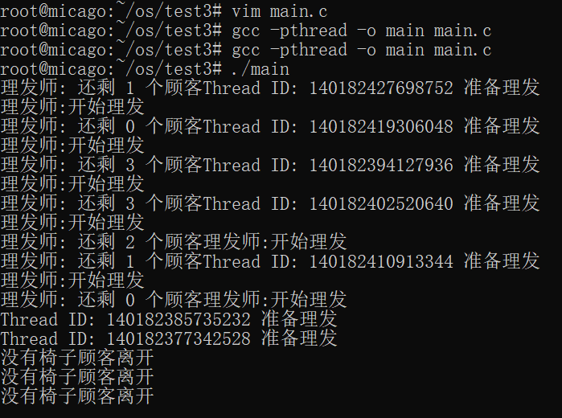
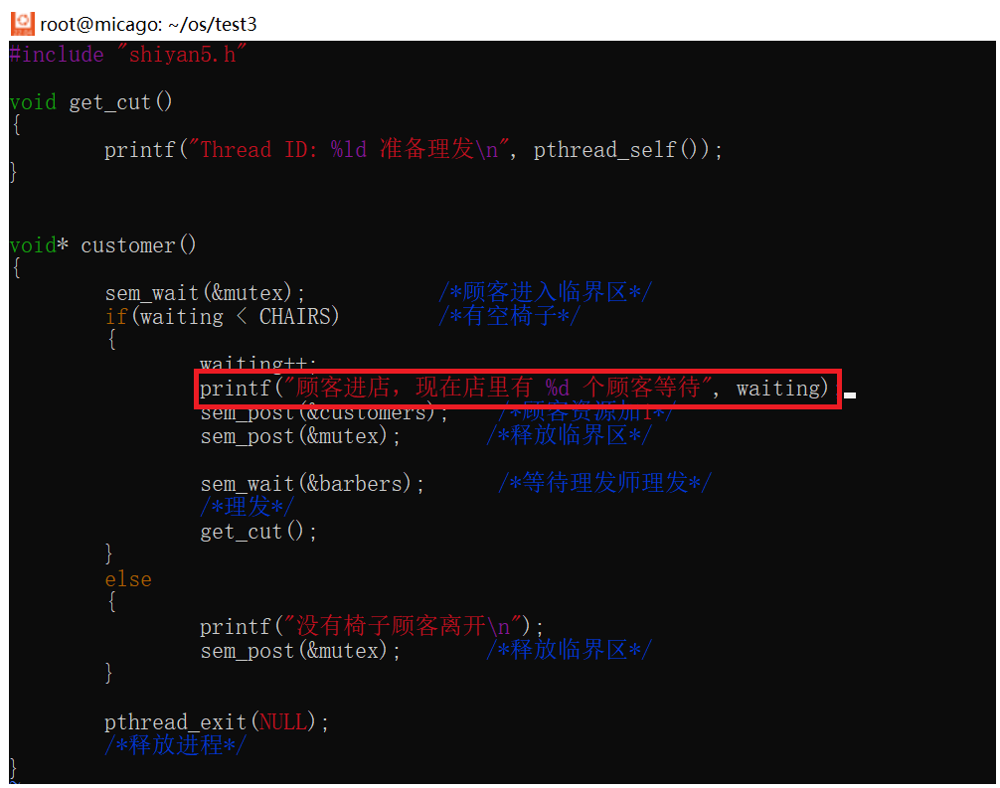
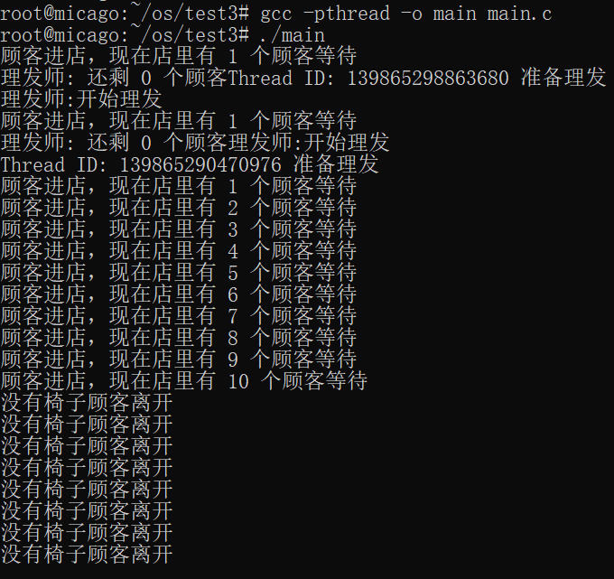
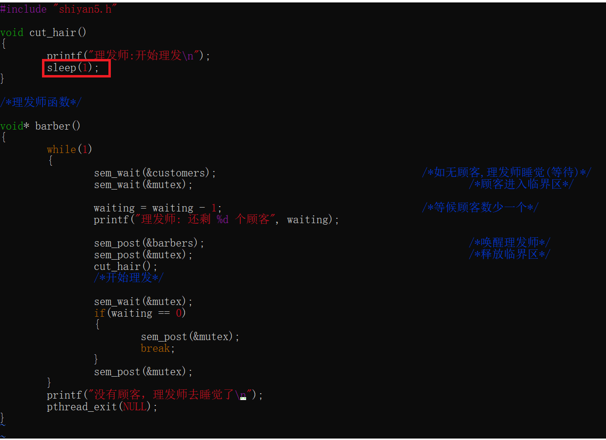
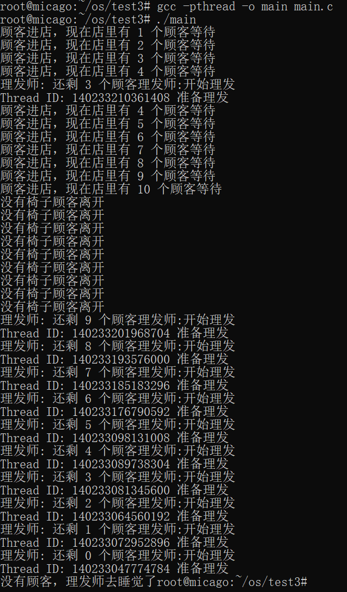
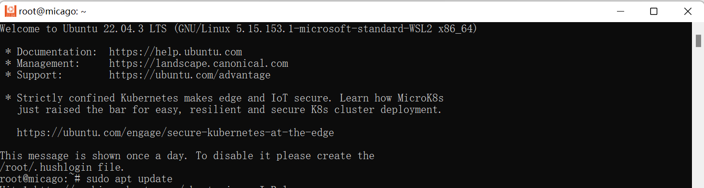
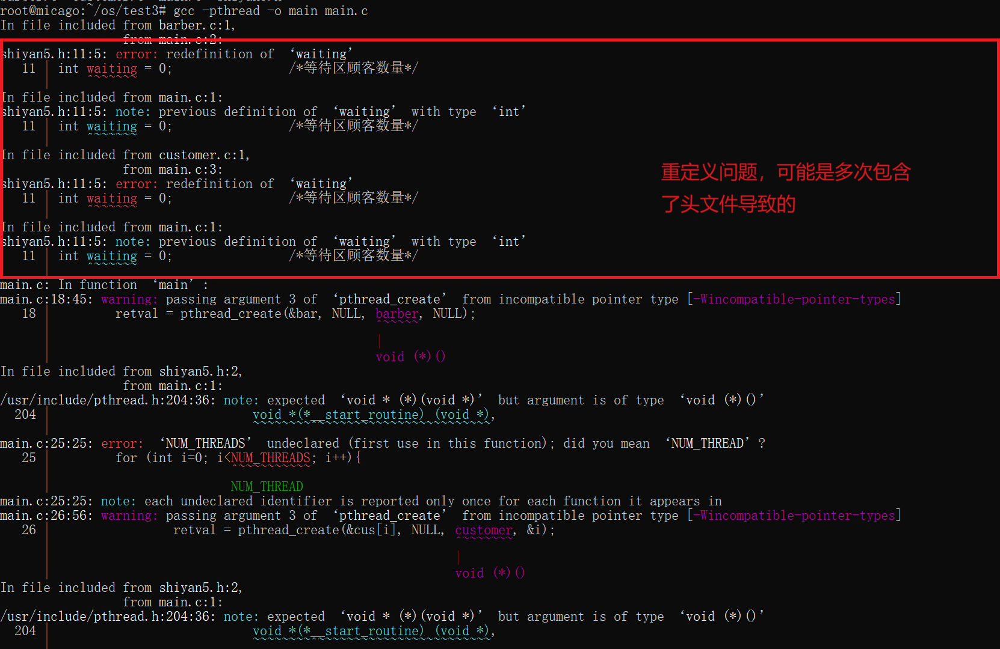
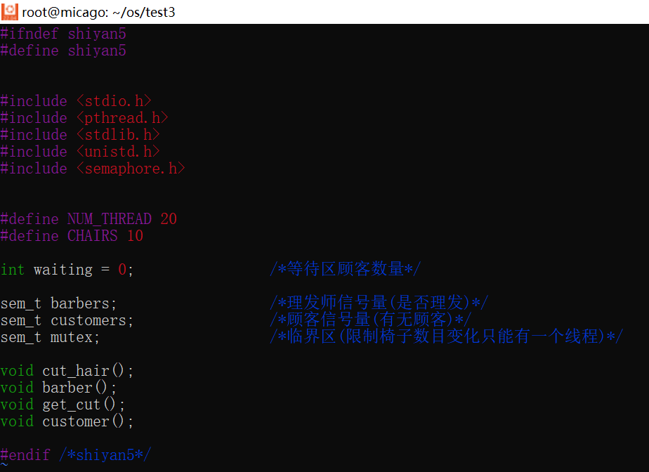
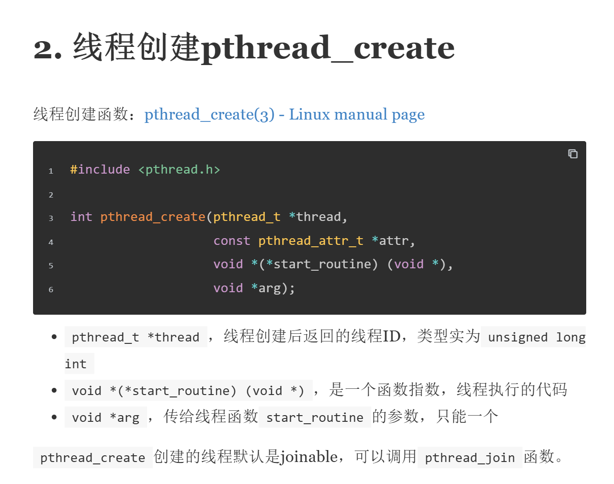
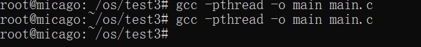

# 1.基本信息
|姓名|学号|班级|是否编译成功|运行结果是否正确|
|:-:|:-:|:-:|:-:|:-:|
|范凯涛|202221331055|计算2212|是|是|
# 2.伪代码

```
//理发师问题

初始化

#define chair 10;		//缓冲区（椅子数量）

int waiting;			//等待区顾客数量

sem_t baber;			//理发师信号量(是否理发)
sem_t customer;			//顾客信号量(有无顾客)
sem_t mutex;			//临界区(同时只能有一个进程改变资源数目)


//理发师函数
void baber(void)
{
    white (true) do
    {
        down(customer);						//如无顾客,理发师睡觉(等待)
        down(mutex);						//顾客进入临界区

        waiting = waiting − 1;				        //等候顾客数少一个
		
		up(baber)					//唤醒理发师
		up(mutex)					//释放临界区

		cut_hair();            				//开始理发
	}  
}

//顾客函数
void customer(void)
{
	white (true) do
	{
		down(mutex);					//顾客进入临界区
		if(waiting < chair)				//有空椅子
		{
			waiting++;
			up(customer);				//顾客资源加1
			up(mutex);				//释放临界区

			down(baber);				//等待理发师理发
			get_cut();							//理发
		}

		else{
			up(mutex);		                //释放临界区
			/*
				没有椅子顾客离开
			*/
		}
	}  
}
```


# 3.主函数
头文件`shiyan5.h`
```
#ifndef shiyan5
#define shiyan5


#include <stdio.h>
#include <pthread.h>
#include <stdlib.h>
#include <unistd.h>
#include <semaphore.h>


#define NUM_THREAD 20
#define CHAIRS 10

int waiting = 0;                /*等待区顾客数量*/

sem_t barbers;                  /*理发师信号量(是否理发)*/
sem_t customers;                /*顾客信号量(有无顾客)*/
sem_t mutex;                    /*临界区(限制椅子数目变化只能有一个线程)*/

void cut_hair();
void* barber();
void get_cut();
void* customer();

#endif // shiyan5

```

--------------------
main
```
#include "shiyan5.h"
#include "barber.c"
#include "customer.c"


int main()
{
        int retval = 0;

        sem_init(&mutex, 0, 1);
        sem_init(&customers, 0, 0);      /*没有理发师*/
        sem_init(&barbers, 0, 0);        /*没有顾客*/

        /*1个理发师，20个顾客*/
        pthread_t bar, cus[NUM_THREAD];

        /*创建理发师*/
        retval = pthread_create(&bar, NULL, barber, NULL);
        if (0 != retval)
        {
                perror("pthread_create error.");
                return -1;
        }

        /*创建顾客*/
        for (int i=0; i<NUM_THREAD; i++){
                retval = pthread_create(&cus[i], NULL, customer, &i);
                if (0 != retval){
                        printf("%d \t return value: %d\n", i, retval);
                        perror("pthread_create error.");
                        return -1;
                }
        }


        /*将理发师和顾客加入阻塞*/
        pthread_join(bar, NULL);
        for (int i=0; i<NUM_THREAD; i++)
        {
                pthread_join(cus[i], NULL);
        }

        return 0;
}
```

# 4.顾客函数


```
#include "shiyan5.h"

void get_cut()
{
        printf("Thread ID: %ld 准备理发\n", pthread_self());
}


void* customer()
{
        sem_wait(&mutex);           /*顾客进入临界区*/
        if(waiting < CHAIRS)        /*有空椅子*/
        {
                waiting++;
                printf("顾客进店，现在店里有 %d 个顾客等待\n", waiting);
                sem_post(&customers);    /*顾客资源加1*/
                sem_post(&mutex);       /*释放临界区*/

                sem_wait(&barbers);      /*等待理发师理发*/
                /*理发*/
                get_cut();
        }
        else
        {
                printf("没有椅子顾客离开\n");
                sem_post(&mutex);       /*释放临界区*/
        }

        pthread_exit(NULL);
        /*释放进程*/
}
```
# 5.理发师函数
```
#include "shiyan5.h"

void cut_hair()
{
        printf("理发师:开始理发\n");
        sleep(1);
}

/*理发师函数*/

void* barber()
{
        while(1)
        {
                sem_wait(&customers);                                   /*如无顾客,理发师睡觉(等待)*/
                sem_wait(&mutex);                                               /*顾客进入临界区*/

                waiting = waiting - 1;                                  /*等候顾客数少一个*/
                printf("理发师: 还剩 %d 个顾客\n", waiting);

                sem_post(&barbers);                                             /*唤醒理发师*/
                sem_post(&mutex);                                               /*释放临界区*/
                cut_hair();
                /*开始理发*/

                sem_wait(&mutex);
                if(waiting == 0)
                {
                        sem_post(&mutex);
                        break;
                }
                sem_post(&mutex);
        }
        printf("没有顾客，理发师去睡觉了\n");
        pthread_exit(NULL);
}
```

# 6.运行结果及分析
## 第一次运行
### 运行结果

### 分析
我定义了1个理发师及20个顾客，但并没有完整运行，只有10个顾客进入了理发店，`疑似在运行途中遇到了死锁`导致了程序卡死。
### 处理
在顾客进店时加入提示信息，检查死锁产生代码 


--------------------------
## 第二次测试: 
### 运行结果

### 分析
发现20顾客进店是正常的,而理发师只理了两个顾客就停止了，故判断死锁产生在`理发师进行理发时`
### 处理
检查理发师代码发现，理发函数没有加上延迟，顾客一进店就瞬间完成了理发，导致后续顾客来不及进店，理发师判断无顾客直接睡觉去了，终止了进程，后续的顾客应为缺少理发师而卡死在等待理发的步骤。

-------------------------
## 第三次测试
### 处理
在理发师函数的理发函数中加上理发的延时

### 运行结果

成功解决问题，完成实验理发师问题！

--------------------


# 7.实验中遇到的问题及解决办法
## 1. 电脑上没有linux环境，不方便调试代码
解决：安装ubuntu并安装gcc用于模拟linux环境调试代码

## 2. 重定义问题

解决:在头文件中加入ifndef 来限制只包含一次头文件

## 3. 函数参数不对
pthread_create 函数传参传的是函数指针


解决:
修改头文件和对应函数参数


## 解决所有问题成功编译

# 8.附完整源代码
```
#ifndef shiyan5
#define shiyan5


#include <stdio.h>
#include <pthread.h>
#include <stdlib.h>
#include <unistd.h>
#include <semaphore.h>


#define NUM_THREAD 20
#define CHAIRS 10

int waiting = 0;                /*等待区顾客数量*/

sem_t barbers;                  /*理发师信号量(是否理发)*/
sem_t customers;                /*顾客信号量(有无顾客)*/
sem_t mutex;                    /*临界区(限制椅子数目变化只能有一个线程)*/

void cut_hair();
void* barber();
void get_cut();
void* customer();

#endif // shiyan5

--------------------
#include "shiyan5.h"

void cut_hair()
{
        printf("理发师:开始理发\n");
        sleep(1);
}

/*理发师函数*/

void* barber()
{
        while(1)
        {
                sem_wait(&customers);                                   /*如无顾客,理发师睡觉(等待)*/
                sem_wait(&mutex);                                               /*顾客进入临界区*/

                waiting = waiting - 1;                                  /*等候顾客数少一个*/
                printf("理发师: 还剩 %d 个顾客\n", waiting);

                sem_post(&barbers);                                             /*唤醒理发师*/
                sem_post(&mutex);                                               /*释放临界区*/
                cut_hair();
                /*开始理发*/

                sem_wait(&mutex);
                if(waiting == 0)
                {
                        sem_post(&mutex);
                        break;
                }
                sem_post(&mutex);
        }
        printf("没有顾客，理发师去睡觉了\n");
        pthread_exit(NULL);
}

---------------------
#include "shiyan5.h"

void get_cut()
{
printf("Thread ID: %ld 准备理发\n", pthread_self());
}


void customer()
{
sem_wait(&mutex);           /*顾客进入临界区*/
if(waiting < CHAIRS)        /*有空椅子*/
{
waiting++;
sem_post(&customers);    /*顾客资源加1*/
sem_post(&mutex);       /*释放临界区*/

sem_wait(&barbers);      /*等待理发师理发*/
/*理发*/
get_cut();
}
else
{
printf("没有椅子顾客离开\n");
sem_post(&mutex);       /*释放临界区*/
}

pthread_exit(NULL);
/*释放进程*/
}

-------------------
#include "shiyan5.h"
#include "barber.c"
#include "customer.c"


int main()
{
    int retval = 0;
    sem_init(&mutex, 0, 1);
    sem_init(&customers, 0, 0);      /*没有理发师*/
    sem_init(&barbers, 0, 0);        /*没有顾客*/
    /*1个理发师，20个顾客*/
    pthread_t bar, cus[NUM_THREAD];
    /*创建理发师*/
    retval = pthread_create(&bar, NULL, barber, NULL);
    if (0 != retval)
    {
            perror("pthread_create error.");
            return -1;
    }
    /*创建顾客*/
    for (int i=0; i<NUM_THREAD; i++){
            retval = pthread_create(&cus[i], NULL, customer, &i);
            if (0 != retval){
                    printf("%d \t return value: %d\n", i, retval);
                    perror("pthread_create error.");
                    return -1;
            }
    }
    /*将理发师和顾客加入阻塞*/
    pthread_join(bar, NULL);
    for (int i=0; i<NUM_THREAD; i++)
    {
            pthread_join(cus[i], NULL);
    }
    return 0;
}
```