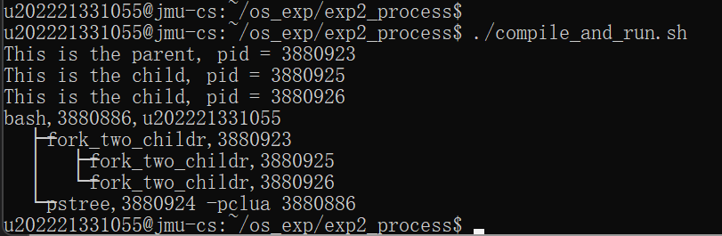
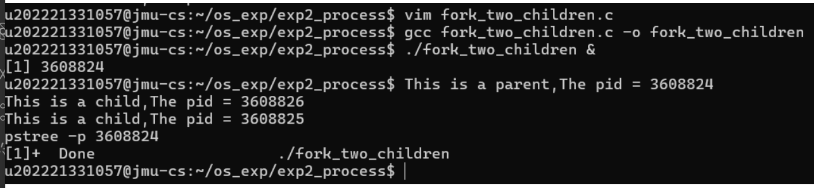
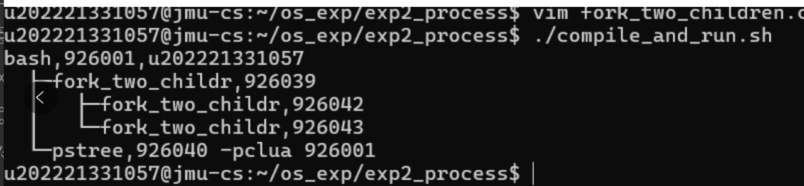

# 实验二报告
  
  
- [实验二报告](#实验二报告 )
  - [基本信息](#基本信息 )
  - [实现思路 & 源码](#实现思路--源码 )
  - [打印进程树](#打印进程树 )
  - [实验中遇到的问题及解决方法](#实验中遇到的问题及解决方法 )
  
## 基本信息
  
|姓名 |班级 |学号 |实验时间|实验地点|编译是否成功|是否运行结果正确|
|:---:|:---:|:---:|:--------:|:-:|:-:|:-:|
|范凯涛|计算2212|202221331055|2024/3/21|陆大214|是|是|


  
  
## 实现思路 & 源码
  
- 实现思路
    1. 使用fork函数创建子进程
    2. 使用getpid()函数获取当前进程id
    3. 使用sleep()函数休眠挂起等待打印进程树
-----------------------
- 源码
```
   int main(){
        int pid;
        int pid1;
        char *message;
        int n;
        pid = fork();                   //第一个子进程
        if(pid < 0){
                perror("fork failed");
                exit(1);
        }
        if(pid == 0){
                message = "This is the child";
                n = 1;
        }else{
                message = "This is the parent";
                n = 1;
                pid1 = fork();          //第二个子进程
               if(pid1 == 0){
                       printf("This is the child, pid = %d\n", getpid());
                       sleep(30);       //休眠挂起等待打印进程树
                       exit(1);
               }
        }
        for(; n > 0; n--){
                printf("%s, pid = %d\n",message, getpid());
                sleep(30);              //休眠挂起等待打印进程树
        }
        return 0;
}
```
  
先创建第一个子进程，在获取父进程pid时再创建第二个子进程
  
## 打印进程树
  
运行结果:
       
  
  
  
  
## 实验中遇到的问题及解决方法
  
1. 手动编译时无法在运行后使用打印树的指令
        解决：
  
        在指令`./fork_two_children`后加上`&`即可在后台运行可执行文件时，使用指令打印树
  
2. 手动编译运行无法打印树
        
        但使用自动编译执行却可以
        
        解决
  
        查看`./complie_and_run.sh`文件后发现:
        自动编译时有使用-o，我手动编译时没有
        可能导致**fork_two_children**文件被当作fork_two_children.c文件的**输出**文件而不是连接器的输入。
  
# 实验二报告
  
  
- [实验二报告](#实验二报告 )
  - [基本信息](#基本信息 )
  - [实现思路 & 源码](#实现思路--源码 )
  - [打印进程树](#打印进程树 )
  - [实验中遇到的问题及解决方法](#实验中遇到的问题及解决方法 )
  
## 基本信息
  
|姓名 |班级 |学号 |实验时间|实验地点|编译是否成功|是否运行结果正确|
|:---:|:---:|:---:|:--------:|:-:|:-:|:-:|
|范凯涛|计算2212|202221331055|2024/3/21|陆大214|是|是|
  
  
  
## 实现思路 & 源码
  
- 实现思路
    1. 使用fork函数创建子进程
    2. 使用getpid()函数获取当前进程id
    3. 使用sleep()函数休眠挂起等待打印进程树
-----------------------
- 源码
```
   int main(){
        int pid;
        int pid1;
        char *message;
        int n;
        pid = fork();                   //第一个子进程
        if(pid < 0){
                perror("fork failed");
                exit(1);
        }
        if(pid == 0){
                message = "This is the child";
                n = 1;
        }else{
                message = "This is the parent";
                n = 1;
                pid1 = fork();          //第二个子进程
               if(pid1 == 0){
                       printf("This is the child, pid = %d\n", getpid());
                       sleep(30);       //休眠挂起等待打印进程树
                       exit(1);
               }
        }
        for(; n > 0; n--){
                printf("%s, pid = %d\n",message, getpid());
                sleep(30);              //休眠挂起等待打印进程树
        }
        return 0;
}
```
  
先创建第一个子进程，在获取父进程pid时再创建第二个子进程
  
## 打印进程树
  
运行结果:
       
  
  
  
  
## 实验中遇到的问题及解决方法
  
1. 手动编译时无法在运行后使用打印树的指令
        解决：
  
        在指令`./fork_two_children`后加上`&`即可在后台运行可执行文件时，使用指令打印树
  
2. 手动编译运行无法打印树
        
        但使用自动编译执行却可以
        
        解决
  
        查看`./complie_and_run.sh`文件后发现:
        自动编译时有使用-o，我手动编译时没有
        可能导致**fork_two_children**文件被当作fork_two_children.c文件的**输出**文件而不是连接器的输入。
  
